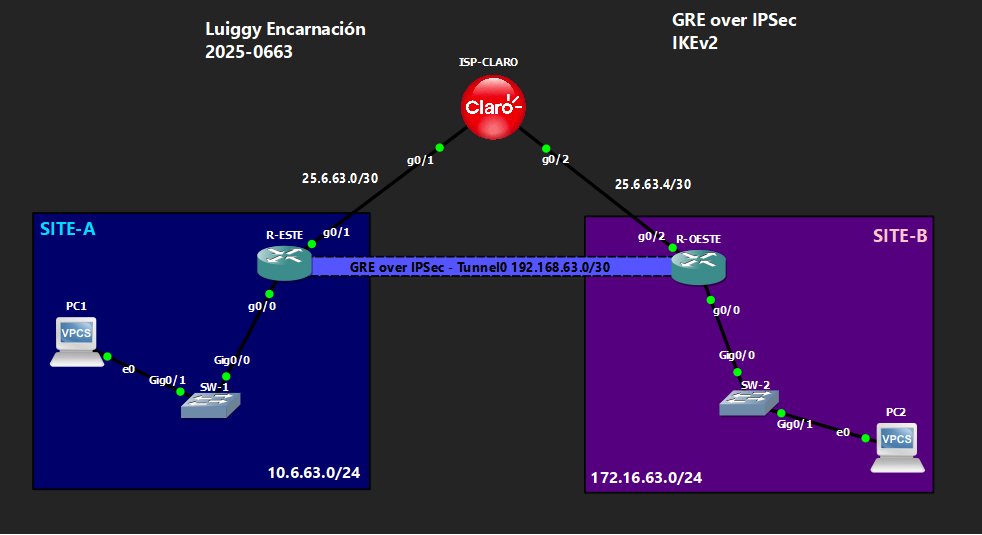

# 🔒 VPN GRE over IPSec — IKEv2

**Luiggy Habraham Encarnación Cabrera · Matrícula 2025-0663**


> Migración del túnel GRE over IPSec a IKEv2, usando perfiles y keyring dedicados por peer.

---

## 📑 Tabla de Contenido

1. [Objetivo del Laboratorio](#-objetivo-del-laboratorio)
2. [Parámetros Usados](#-parámetros-usados)
3. [Documentación de la Red](#️-documentación-de-la-red)
4. [Funcionamiento de la VPN](#-funcionamiento-de-la-vpn)
5. [Configuración](#-configuración)
6. [Verificación](#-verificación)
7. [Capturas de Pantalla](#-capturas-de-pantalla)
8. [Video de Demostración](#-video-de-demostración)

---

## 🎯 Objetivo del Laboratorio

Migrar el escenario de GRE over IPSec a **IKEv2**, reemplazando ISAKMP por el marco `crypto ikev2 proposal/policy/keyring/profile`. El objetivo es demostrar las diferencias estructurales entre IKEv1 e IKEv2 (perfiles explícitos por peer, keyring dedicado) manteniendo la misma función: cifrar el tráfico GRE entre SITE-A y SITE-B y permitir OSPF sobre el túnel.

---

## 🧩 Parámetros Usados

| Parámetro | Valor |
|---|---|
| Versión IKE | IKEv2 |
| Cifrado Fase 1 | AES-CBC-256 |
| Integridad Fase 1 | SHA256 |
| Autenticación | Pre-shared key (`Luiggy20250663!`) vía keyring nombrado por peer |
| Grupo DH | 14 |
| Transform-set (Fase 2) | esp-aes 256 + esp-sha-hmac |
| Modo IPSec | Transporte |
| Encapsulamiento | GRE punto a punto (`tunnel mode gre ip`) |
| Tráfico protegido | ACL `GRE-VPN` → protocolo GRE entre IPs públicas |
| Enrutamiento dinámico | OSPF área 0 sobre Tunnel0 |

---

## 🗺️ Documentación de la Red

### Topología



### Tabla de Direccionamiento

| Dispositivo | Interfaz | IP | Red |
|---|---|---|---|
| ISP-CLARO | g0/1 | 25.6.63.2/30 | Enlace hacia R-ESTE |
| ISP-CLARO | g0/2 | 25.6.63.5/30 | Enlace hacia R-OESTE |
| ISP-CLARO | Lo0 | 20.20.20.20/32 | Loopback de pruebas |
| R-ESTE | g0/1 (WAN) | 25.6.63.1/30 | Hacia ISP |
| R-ESTE | g0/0 (LAN) | 10.6.63.1/24 | SITE-A |
| R-ESTE | Tunnel0 | 192.168.63.1/30 | Túnel GRE |
| R-OESTE | g0/2 (WAN) | 25.6.63.6/30 | Hacia ISP |
| R-OESTE | g0/0 (LAN) | 172.16.63.1/24 | SITE-B |
| R-OESTE | Tunnel0 | 192.168.63.2/30 | Túnel GRE |

### Detalles del Entorno

| Parámetro | Valor |
|---|---|
| Emulador | GNS3 / Packet Tracer |
| Dispositivos Cisco | IOU / Router IOS |
| VLANs | VLAN 1 (default) en SW-1 y SW-2 |
| Sitios | SITE-A (10.6.63.0/24), SITE-B (172.16.63.0/24) |

---

## 🔬 Funcionamiento de la VPN

**Fase 1 (IKEv2):**
- `crypto ikev2 proposal IKEV2-PROP`: AES-CBC-256, integridad SHA256, grupo DH 14.
- `crypto ikev2 policy IKEV2-POLICY` referencia la propuesta.
- `crypto ikev2 keyring VPN-KEYRING`: a diferencia de IKEv1, la PSK se define **por peer nombrado**, no solo por IP.
- `crypto ikev2 profile VPN-IKE-PROFILE`: define identidad remota, autenticación local/remota y qué keyring usar.

**Fase 2 (IPSec):**
- Igual que en IKEv1: `transform-set` en modo transporte.
- El `crypto map` ahora incluye `set ikev2-profile VPN-IKE-PROFILE` además de `set peer` y `set transform-set`.
- La ACL `GRE-VPN` sigue siendo la misma: solo tráfico GRE entre IPs públicas.

**GRE:**
- Misma lógica que IKEv1: `tunnel mode gre ip`, OSPF corriendo sobre Tunnel0.

**Diferencia clave frente a IKEv1:** IKEv2 requiere definir explícitamente el perfil y el keyring por peer, más escalable y seguro para escenarios con múltiples túneles.

---

## 🔧 Configuración

Ver archivo: `Configuración de VPN GRE over IPSec IKEv2.txt`

---

## ✅ Verificación

```
show ip route
show crypto ikev2 sa
show crypto ipsec sa
show ip ospf neighbor
```

Se espera:
- `show crypto ikev2 sa` → SA en estado **READY**.
- `show crypto ipsec sa` → contadores de encaps/decaps incrementando.
- `show ip route` → ruta a la LAN remota vía OSPF sobre Tunnel0.

---

## 📸 Capturas de Pantalla

```
evidencias/
├── 01_topologia.png
├── 02_crypto_ikev2_profile_keyring.png
├── 03_crypto_map_tunnel.png
├── 04_show_crypto_ikev2_sa.png
├── 05_show_crypto_ipsec_sa.png
├── 06_show_ip_ospf_neighbor.png
├── 07_show_ip_route.png
└── 08_ping_pc1_pc2.png
```

---

## 🎬 Video de Demostración

> 📺 **[Ver demostración en YouTube →](https://youtu.be/6pmo41XjzEM)**
